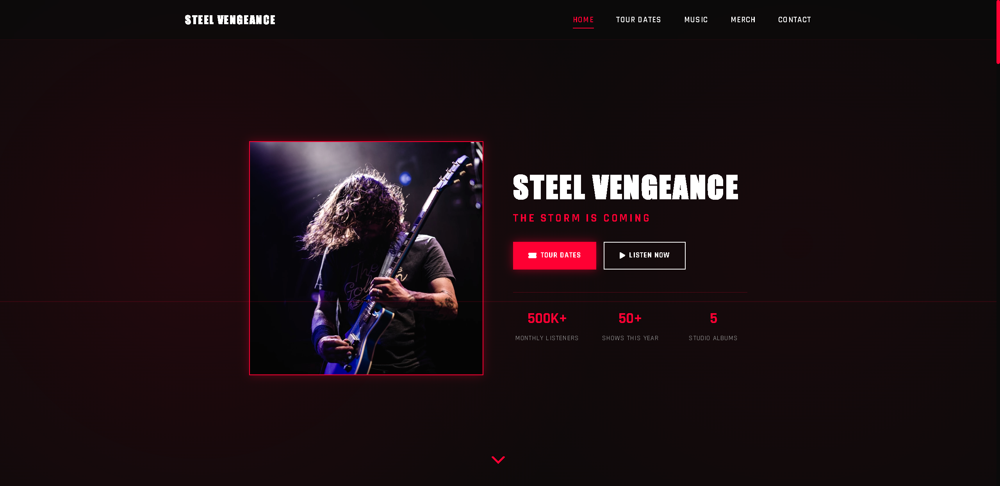
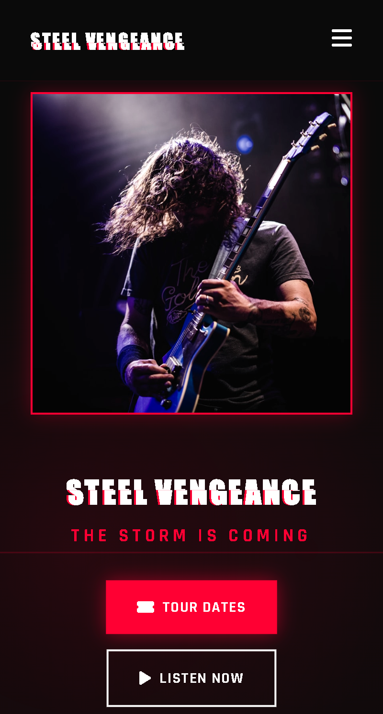

# 🎸 Metal Band Website

<div align="center">


### 🔥 A modern, animated, and visually stunning website for a metal band

[](https://metalbandwebsite.vercel.app)
[](https://vuejs.org/)
[](https://vitejs.dev/)
[](https://tailwindcss.com/)

**[🚀 Live Demo](https://metalbandwebsite.vercel.app)** | **[📖 Documentation](#-features)** | **[💻 Installation](#-installation)**

</div>

---

## ✨ Features

<table>
<tr>
<td width="50%">

### 🎨 Design & Aesthetics
- 🌑 **Dark & Edgy Theme** - Immersive black and red color palette
- ⚡ **Cyberpunk Aesthetics** - Futuristic glitch effects
- 🎭 **Retro CRT Effects** - Scanline and noise overlays
- 💫 **Smooth Animations** - Custom CSS transitions
- 📱 **Fully Responsive** - Mobile, tablet & desktop optimized

</td>
<td width="50%">

### 🎵 Features & Functionality
- 🎸 **Interactive Sections** - Home, Tour, Music, Merch, Contact
- 🎫 **Tour Dates Display** - Dynamic concert schedule
- 🎵 **Spotify Integration** - Music player mockup
- 🛍️ **Merch Showcase** - Product gallery with animations
- 📧 **Contact Form** - Functional form with validation

</td>
</tr>
</table>

## 🛠️ Tech Stack

<div align="center">

| Technology | Description | Version |
|------------|-------------|---------|
|  | Progressive JavaScript Framework | 3.4.15 |
|  | Next-Gen Frontend Tooling | 5.0.12 |
|  | Utility-First CSS Framework | 3.4.1 |
|  | Icon Library | 6.5.1 |
|  | Deployment Platform | Latest |

</div>

## 📦 Installation

### Quick Start

```bash
# Clone the repository
git clone https://github.com/onurceyhan/metal-band-website.git
cd metal-band-website

# Install dependencies
npm install

# Run development server (http://localhost:3000)
npm run dev

# Build for production
npm run build

# Preview production build
npm run preview
```

### 🚀 Deploy to Vercel

[](https://vercel.com/new/clone?repository-url=https://github.com/onurceyhan/metal-band-website)

```bash
# Install Vercel CLI
npm i -g vercel

# Deploy to Vercel
vercel
```

## 📁 Project Structure

```
metal-band-website/
├── public/              # Static assets
├── src/
│   ├── components/      # Vue components
│   │   ├── Navigation.vue
│   │   ├── Hero.vue
│   │   ├── TourDates.vue
│   │   ├── SpotifyPlayer.vue
│   │   ├── Music.vue
│   │   ├── Merch.vue
│   │   └── Contact.vue
│   ├── App.vue         # Root component
│   ├── main.js         # Application entry point
│   └── style.css       # Global styles
├── index.html          # HTML entry point
├── package.json        # Dependencies and scripts
├── vite.config.js      # Vite configuration
├── tailwind.config.js  # Tailwind CSS configuration
└── postcss.config.js   # PostCSS configuration
```

## 🎨 Key Components

<details>
<summary><b>🧭 Navigation Component</b></summary>

- ✨ Sticky navigation bar with smooth scrolling
- 🎯 Active section highlighting
- 📱 Mobile-responsive hamburger menu
- ⚡ Glitch effect on logo
- 🌊 Smooth scroll transitions

</details>

<details>
<summary><b>🦸 Hero Section</b></summary>

- 🖼️ Large hero image with glitch overlay effects
- 🎬 Animated call-to-action buttons
- 📊 Band statistics display
- ⬇️ Animated scroll indicator
- 💫 Float and pulse animations

</details>

<details>
<summary><b>🎫 Tour Dates</b></summary>

- 📅 Grid layout of upcoming shows
- 🎭 Hover animations on cards
- 🔴 Sold-out status indicators
- 📱 Fully responsive design
- ✨ Slide-up entrance animations

</details>

<details>
<summary><b>🎵 Spotify Player</b></summary>

- 🎮 Interactive player mockup
- 📊 Animated progress bar
- 🔗 Multi-platform links (Spotify, Apple Music, YouTube)
- 🎨 Floating Spotify icon with glow effect
- ▶️ Play/pause functionality

</details>

<details>
<summary><b>💿 Music Section</b></summary>

- 🎼 Album grid with hover effects
- ▶️ Play button overlays
- 🌐 Multi-platform streaming links
- 📀 Album information cards
- ✨ Fade-in animations

</details>

<details>
<summary><b>🛍️ Merchandise Store</b></summary>

- 🎁 Product showcase grid
- 🏷️ Badge indicators (New, Bestseller, Limited)
- 🔍 Quick view functionality
- 🛒 Add to cart buttons
- 💫 Interactive hover states

</details>

<details>
<summary><b>📧 Contact Section</b></summary>

- 📞 Contact information display
- 🌐 Social media links
- ✉️ Functional contact form
- ✅ Form validation
- 📱 Responsive layout

</details>

## 🎭 Animations & Effects

- **Glitch Effect** - Custom CSS glitch animation on text and images
- **Scanline** - Retro CRT scanline effect overlay
- **Noise** - Subtle noise texture overlay
- **Float Animation** - Smooth floating animations
- **Slide Up** - Entrance animations for sections
- **Hover Effects** - Interactive hover states throughout

## 🎨 Color Palette

- **Primary Red**: `#ff0033` - Main accent color
- **Dark Background**: `#0a0a0a` - Primary background
- **Secondary Dark**: `#1a1a1a` - Card backgrounds
- **White**: `#ffffff` - Text and highlights

## 📱 Responsive Breakpoints

- **Mobile**: < 640px
- **Tablet**: 640px - 968px
- **Desktop**: > 968px

## 🚀 Performance Optimizations

- Lazy loading of images
- Optimized animations with CSS transforms
- Minimal JavaScript for better performance
- Vite's built-in code splitting

## 🔧 Configuration

### Customization

You can easily customize the website by modifying:

- **Colors**: `tailwind.config.js` - Update the color scheme
- **Fonts**: `index.html` and `tailwind.config.js` - Change typography
- **Content**: Component files - Update text, images, and data
- **Animations**: `src/style.css` - Modify or add animations

### Environment Variables

Create a `.env` file in the root directory for any environment-specific configurations:

```env
VITE_API_URL=your_api_url_here
```

## 📄 License

This project is open source and available under the [MIT License](LICENSE).

## 👨‍💻 Author

<div align="center">

### Onur Ceyhan

[](https://github.com/onurceyhan)
[](https://linkedin.com/in/onur-ceyhan)

**Made with ❤️ and 🎸**

</div>

## 🙏 Acknowledgments

- Design inspired by modern metal band aesthetics and cyberpunk themes
- Images from [Unsplash](https://unsplash.com)
- Icons from [Font Awesome](https://fontawesome.com)
- Fonts from [Google Fonts](https://fonts.google.com)

## 🤝 Contributing

Contributions, issues, and feature requests are welcome! Feel free to check the [issues page](https://github.com/onurceyhan/metal-band-website/issues).

1. Fork the project
2. Create your feature branch (`git checkout -b feature/AmazingFeature`)
3. Commit your changes (`git commit -m 'Add some AmazingFeature'`)
4. Push to the branch (`git push origin feature/AmazingFeature`)
5. Open a Pull Request

## 📸 Screenshots & Demo

<div align="center">

### 🖥️ Live Demo
**[🌐 Visit Live Website](https://metalbandwebsite.vercel.app)**

```
https://metalbandwebsite.vercel.app
```

### Desktop View


### Mobile View


</div>

## 🎯 Future Enhancements

<table>
<tr>
<td width="50%">

### 🚀 Phase 1
- [ ] Backend integration for contact form
- [ ] Real Spotify API integration
- [ ] E-commerce functionality for merch
- [ ] Newsletter subscription

</td>
<td width="50%">

### 🎨 Phase 2
- [ ] Blog/News section
- [ ] Photo gallery
- [ ] Video player integration
- [ ] Language localization (TR/EN)

</td>
</tr>
</table>

---

<div align="center">

## ⭐ Star This Repository

If you found this project helpful or interesting, please consider giving it a star!

[](https://github.com/onurceyhan/metal-band-website/stargazers)
[](https://github.com/onurceyhan/metal-band-website/network/members)

### 🔗 Quick Links

**[🌐 Live Demo](https://metalbandwebsite.vercel.app)** • 
**[📝 Report Bug](https://github.com/onurceyhan/metalbandwebsite/issues)** • 
**[✨ Request Feature](https://github.com/onurceyhan/metalbandwebsite/issues)**

---

### 🎸 Built with passion for metal music 🎸

**© 2026 Onur Ceyhan. All rights reserved.**

</div>

